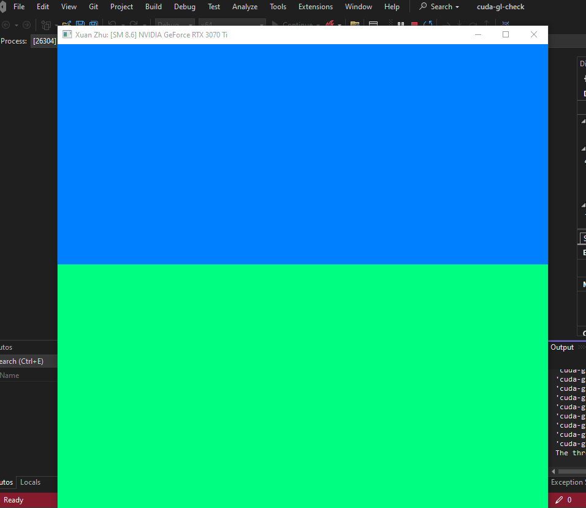
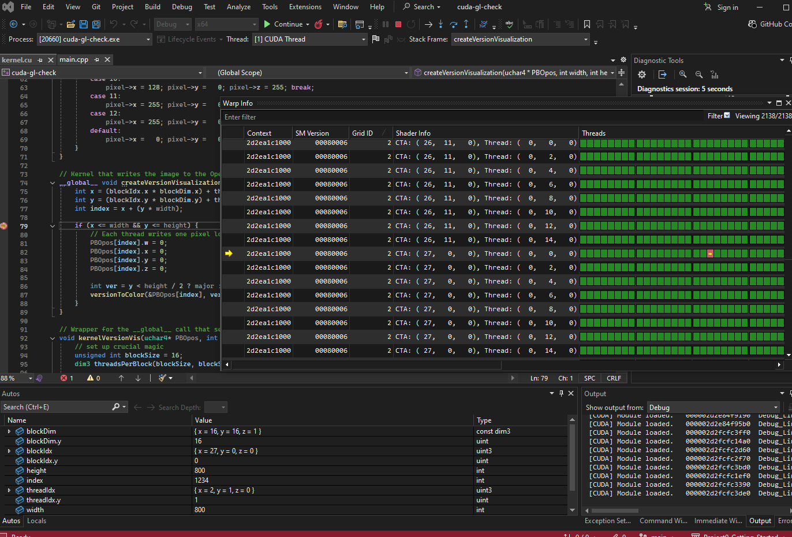
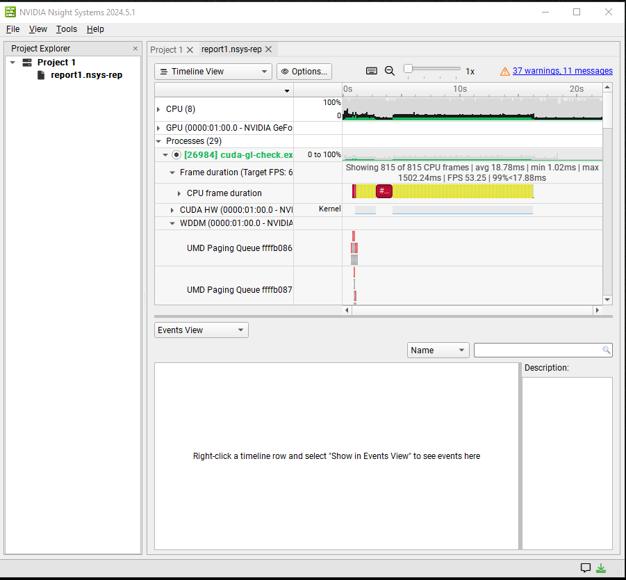
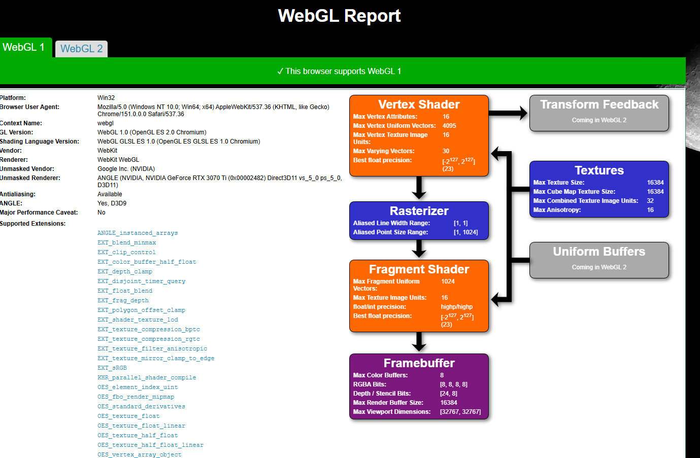
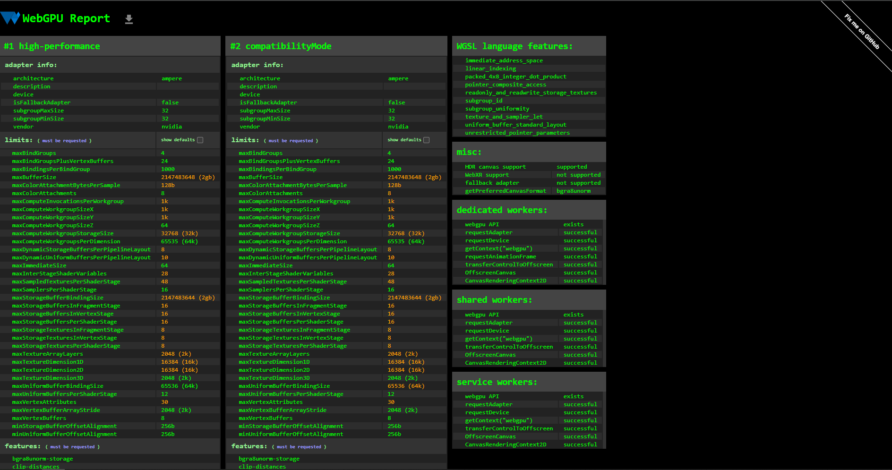

Project 0 Getting Started
====================

**University of Pennsylvania, CIS 5650: GPU Programming and Architecture, Project 0**

* Xuan Zhu
* LinkedIn: www.linkedin.com/in/xuan-zhu-4ba736220
* Tested on: Windows 10, Intel Core i7-6700K @ 4.00GHz 64GB, NVIDIA GeForce RTX 3070 Ti 8GB (SIGLAB Computer)

### Compute Capability

The GPU used is an NVIDIA GeForce RTX 3070 Ti with **Compute Capability 8.6** (SM 8.6).

### Part 2.1.2: CUDA GL Check

### Part 2.1.3: Nsight Debugging

Conditional breakpoint set at `index == 1234` on line 79 of `kernel.cu`.

### Part 2.1.4: Nsight Systems

### Part 2.1.5: Nsight Compute

Skipped per instructor announcement regarding the known issue with `cuda-gl-check`.

### Part 2.2: WebGL

### Part 2.3: WebGPU

